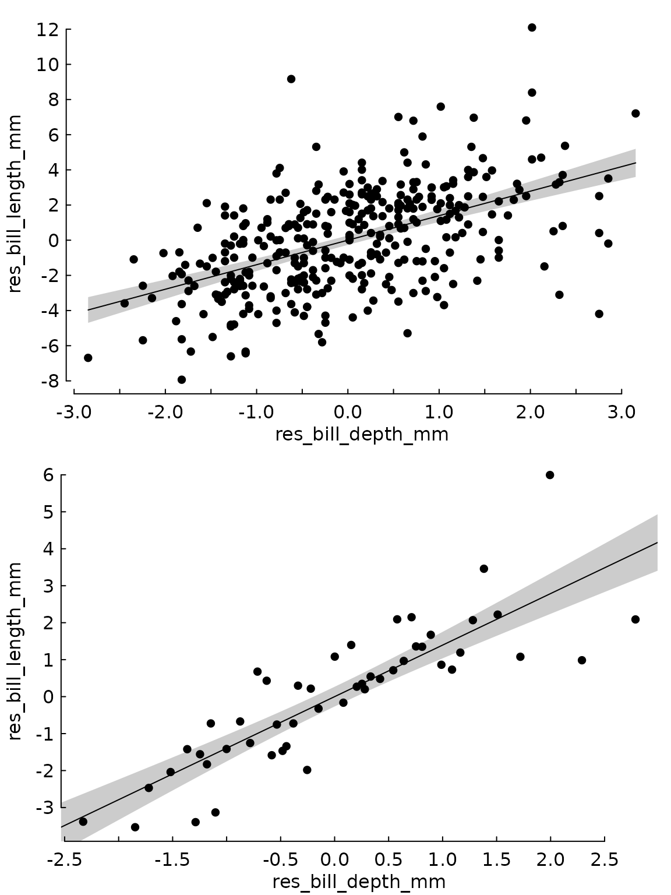
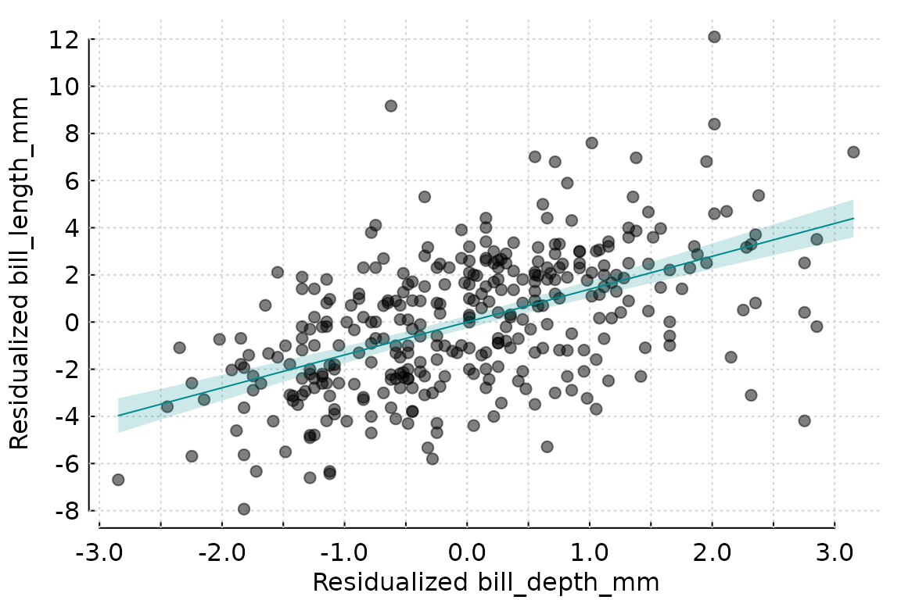

# partialling_out

## Getting started

Let’s make a simple linear model first.

``` r

library(partialling.out)
library(tinytable)
library(tinyplot)
library(palmerpenguins)
library(fwlplot)
model <- lm(bill_length_mm ~ bill_depth_mm + species, data = penguins)
summary(model)
#> 
#> Call:
#> lm(formula = bill_length_mm ~ bill_depth_mm + species, data = penguins)
#> 
#> Residuals:
#>     Min      1Q  Median      3Q     Max 
#> -8.0300 -1.5828  0.0733  1.6925 10.0313 
#> 
#> Coefficients:
#>                  Estimate Std. Error t value Pr(>|t|)    
#> (Intercept)       13.2164     2.2475    5.88 9.83e-09 ***
#> bill_depth_mm      1.3940     0.1220   11.43  < 2e-16 ***
#> speciesChinstrap   9.9390     0.3678   27.02  < 2e-16 ***
#> speciesGentoo     13.4033     0.5118   26.19  < 2e-16 ***
#> ---
#> Signif. codes:  0 '***' 0.001 '**' 0.01 '*' 0.05 '.' 0.1 ' ' 1
#> 
#> Residual standard error: 2.518 on 338 degrees of freedom
#>   (2 observations deleted due to missingness)
#> Multiple R-squared:  0.7892, Adjusted R-squared:  0.7874 
#> F-statistic: 421.9 on 3 and 338 DF,  p-value: < 2.2e-16
```

Using the `partialling_out` function, you can get the residualised
variable of interest (`bill_length_mm`) and of the first explanatory
variable (`bill_depth_mm`), i.e. it would return the residuals of the
following two regressions.

``` r


modely <- lm(bill_length_mm ~ species, data = penguins)

modelx <- lm(bill_depth_mm ~ species, data = penguins)
```

``` r

res <- partialling_out(model, data = penguins)

tt(head(res)) |>
  format_tt(digits = 2) |>
  style_tt(align = "c")
```

| res_bill_length_mm | res_bill_depth_mm |
|--------------------|-------------------|
| 0.31               | 0.35              |
| 0.71               | -0.95             |
| 1.51               | -0.35             |
| -2.09              | 0.95              |
| 0.51               | 2.25              |
| 0.11               | -0.55             |

Accordingly, the coefficient of `res_bill_depth_mm` in the model
`lm(res_bill_length_mm ~ res_bill_depth_mm)` will be the same of the
coefficient of `bill_depth_mm` in the original model.

``` r

resmodel <- lm(res_bill_length_mm ~ res_bill_depth_mm, data = res)

print(c(model$coefficients[2], resmodel$coefficients[2]))
#>     bill_depth_mm res_bill_depth_mm 
#>          1.394011          1.394011
```

If `both` is set to `FALSE`, the function will return the actual Y
values and the residualised X values.

``` r

tt(head(partialling_out(model, penguins, both = FALSE))) |>
  format_tt(digits = 2) |>
  style_tt(align = "c")
```

| bill_length_mm | res_bill_depth_mm |
|----------------|-------------------|
| 39             | 0.35              |
| 40             | -0.95             |
| 40             | -0.35             |
| 37             | 0.95              |
| 39             | 2.25              |
| 39             | -0.55             |

### Weighted models

If `weights` are specified in `partialling_out` they will be used to
weight the underlying partial models. The weights will also be returned
as a column in the result data.frame. If the original model is weighted
but the partial models aren’t, the function will throw a warning (also
if the original model is not weighted but partial models are).

``` r

model <- lm(
  bill_length_mm ~ bill_depth_mm + species,
  data = penguins,
  weights = penguins$body_mass_g
)
res <- partialling_out(model, data = penguins, weights = penguins$body_mass_g)


tt(head(res)) |>
  format_tt(digits = 2) |>
  style_tt(align = "c")
```

| res_bill_length_mm | res_bill_depth_mm | weights |
|--------------------|-------------------|---------|
| 0.129              | 0.27              | 3750    |
| 0.529              | -1.03             | 3800    |
| 1.329              | -0.43             | 3250    |
| -2.271             | 0.87              | 3450    |
| 0.329              | 2.17              | 3650    |
| -0.071             | -0.63             | 3625    |

Note that, for the FWL theorem to hold, if the partial models are
weighted, the linear model between the two residualised variables must
be weighted as well.

``` r

unweighted_model <- lm(res_bill_length_mm ~ res_bill_depth_mm, data = res)

weighted_model <- lm(
  res_bill_length_mm ~ res_bill_depth_mm,
  weights = res$weights,
  data = res
)


data.frame(
  "original model" = model$coefficients[2],
  "unweighted model" = unweighted_model$coefficients[2],
  "weighted_model" = weighted_model$coefficients[2]
) |>
  tt() |>
  format_tt(digits = 4) |>
  style_tt(align = "c")
```

| original.model | unweighted.model | weighted_model |
|----------------|------------------|----------------|
| 1.442          | 1.394            | 1.442          |

## Fixed effects models

As stated, the model will also work with `feols` or `felm` models

``` r

library(fixest)

model_fixest <- feols(bill_length_mm ~ bill_depth_mm | species, data = penguins)

res_fixest <- partialling_out(model_fixest, data = penguins)
tt(head(res_fixest)) |>
  format_tt(digits = 2) |>
  style_tt(align = "c")
```

| res_bill_length_mm | res_bill_depth_mm |
|--------------------|-------------------|
| 0.31               | 0.35              |
| 0.71               | -0.95             |
| 1.51               | -0.35             |
| -2.09              | 0.95              |
| 0.51               | 2.25              |
| 0.11               | -0.55             |

``` r

library(lfe)

model_lfe <- felm(bill_length_mm ~ bill_depth_mm | species, data = penguins)

res_lfe <- partialling_out(model_lfe, data = penguins)


tt(head(res_lfe)) |>
  format_tt(digits = 2) |>
  style_tt(align = "c")
```

| res_bill_length_mm | res_bill_depth_mm |
|--------------------|-------------------|
| 0.31               | 0.35              |
| 0.71               | -0.95             |
| 1.51               | -0.35             |
| -2.09              | 0.95              |
| 0.51               | 2.25              |
| 0.11               | -0.55             |

## Interaction terms and varying slopes

So far, interaction terms with `:`, `*`, or `^` (in `feols`) as well as
varying slopes in `feols` with `[` or `[[` are supported only for
variables other than the main explanatory variable, i.e.

``` r

feols(bill_depth_mm ~ bill_length_mm | species^sex, data = penguins) |>
  partialling_out(data = penguins)
```

is supported, but

``` r

feols(bill_depth_mm ~ i(bill_length_mm, species) | sex, data = penguins) |>
  partialling_out(data = penguins)
```

will yield an error. Therefore, if your main explanatory variable is an
interaction, it should be built outside the model if you intend to
partial it out afterwards.

### AsIs and polynomial terms

So far, AsIs expressions, and polynomial terms in the formula are not
yet supported, so these two expressions will yield an error.

``` r

partialling_out(lm(bill_depth_mm ~ I(bill_length_mm^2) + species,
                   data = penguins))

partialling_out(lm(bill_depth_mm ~  poly(bill_length_mm, 2) + species,
                   data = penguins[!is.na(penguins$bill_length_mm), ]))
```

## Plotting the results

The library includes the function
[`plot_partial_residuals()`](https://docs.ropensci.org/partialling.out/reference/plot_partial_residuals.md)
to plot a scatterplot of the residualised variables with a tendence line
(which can be disabled if the parametre `add_lm` is set to `FALSE`)
using [`tinyplot`](https://github.com/grantmcdermott/tinyplot/) as
backend. If the parametre `quantile` is set to `TRUE` it will divide the
main explanatory variable in the specified number of quantiles (by
default, 50) and plot the mean values for X and Y for each quantile.

``` r


tinytheme("tufte")
par(mfrow = c(2, 1))


plot_partial_residuals(res_fixest)
plot_partial_residuals(res_fixest, quantile = TRUE)
```



Plotting all residuals is equivalent to the following approach in
`fwlplot`

``` r


fwlplot(bill_length_mm ~ bill_depth_mm | species, data = penguins)
```



## Adding other parameters to the model

Any parameters that could be passed to
[`lm()`](https://rdrr.io/r/stats/lm.html),
[`feols()`](https://lrberge.github.io/fixest/reference/feols.html), or
[`felm()`](https://rdrr.io/pkg/lfe/man/felm.html), can be passed to
[`partialling_out()`](https://docs.ropensci.org/partialling.out/reference/partialling_out.md).

``` r

model_fixest <- feols(
  bill_length_mm ~ bill_depth_mm | species + island,
  data = penguins,
  cluster = ~species
)


tt(head(partialling_out(model_fixest, data = penguins, cluster = ~species))) |>
  format_tt(digits = 2) |>
  style_tt(align = "c")
```

| res_bill_length_mm | res_bill_depth_mm |
|--------------------|-------------------|
| 0.149              | 0.27              |
| 0.549              | -1.03             |
| 1.349              | -0.43             |
| -2.251             | 0.87              |
| 0.349              | 2.17              |
| -0.051             | -0.63             |

## Acknowledgements

To the authors of the [fwlplot](https://github.com/kylebutts/fwlplot)
package, Kyle Butts and Grant McDermott, which has provided inspiration
and ideas for this project. To my colleague Andreu Arenas-Jal for his
insight and guiding.
